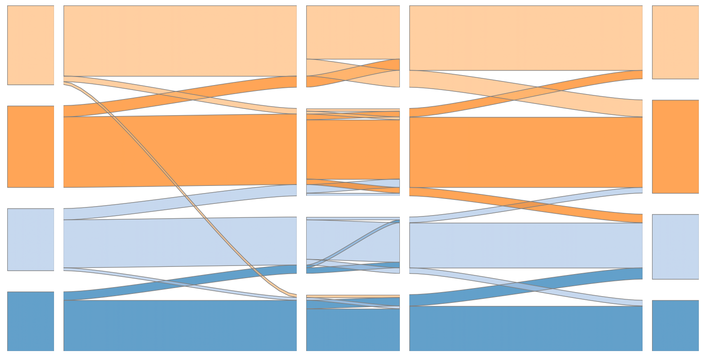

# Composite Alluvial Plot



This script creates a composite alluvial plot of the flow of units across different sequential categories. 
To use, call
```cmd
python .\Composite_alluvial.py <Pandas dataframe CSV>
```
where `<Pandas dataframe CSV>` is a Comma-Separated Variables file directory string where the first column are unit ids and the other columns are in a time series of unit categorization or membership. For example:
```
id,T1,T2,T3
0,1,1,1
1,2,2,2
2,3,3,3
3,2,2,2
```
where each row represents a single unit's path through the categories (T1, T2, T3), and the first column contains unique identifiers.

To see an example visualization, you can just run 
```cmd
python .\Composite_alluvial.py
```